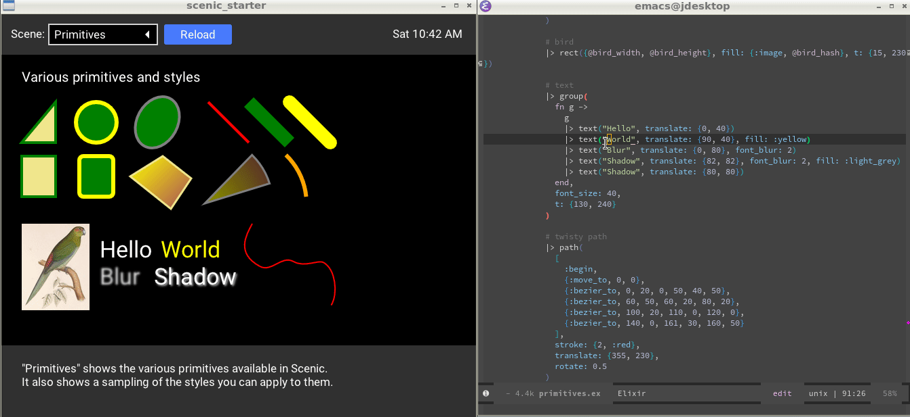

A demo using [Scenic Live Reload](https://github.com/axelson/scenic_live_reload/).

# How it works

Live compilation is provided by
[ScenicLiveReload](https://github.com/axelson/scenic_live_reload) (which uses
[ExSync](https://github.com/falood/exsync) to do the heavy lifting). The flow
goes like this:

1. You edit a `.ex` file in your editor
2. ExSync detects the file edit and recompiles and reloads the file you edited
3. If there are no further file edits than ExSync calls the configured `:reload_callback`
4. The default `:reload_callback` calls into `ScenicLiveReload` which finds the
   current root scene and kills it
5. The root scene's supervisor then restarts the root scene with the new code
   that you just wrote

